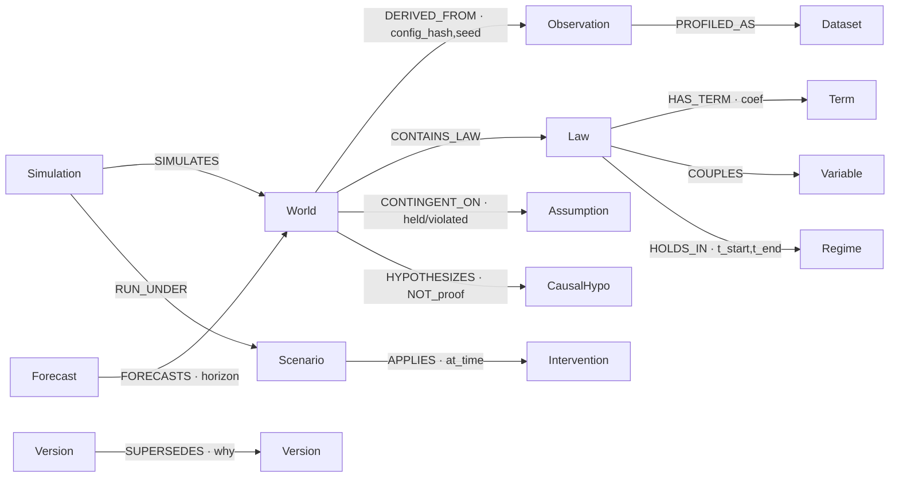
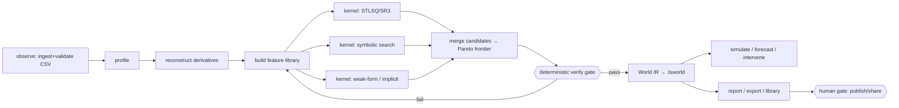

# LawSynth — Enterprise Architecture

> Deep architecture plan. Grounded in the current workspace (57 crates, 4 services,
> 5 TS apps, 7 TS packages, a Python SDK), it describes what LawSynth is today, the
> enterprise-scale structure it grows into, the graph model that ties it together, its
> open-source foundations, and an honest scale/readiness ladder.
>
> This document supersedes the previous one-page engine note. It is a **planning
> document** — no runtime behavior is asserted here that the crate APIs, CLI help, and
> tests do not already define. Aspirational structure is labelled as such.

---

## 1. What it is + current state

### 1.1 One sentence

LawSynth discovers **interpretable governing equations from time-series data** — a
deterministic, offline, local-first alternative to black-box ML and to
symbolic-regression / SINDy pipelines. Point it at a CSV; it recovers the sparse system
of state laws (`dx/dt = …`) behind the numbers and hands back a portable, self-contained
mathematical *world* you can read, simulate, stress-test, compare, and share.

### 1.2 The product loop

```
observe (CSV) → discover (laws) → understand (explain) → use (simulate / forecast /
intervene) → compare → share (report / .lsworld bundle) → organize (library)
```

Every step is **deterministic** (identical inputs + options reproduce the same world)
and **offline** (no data leaves the machine). A discovery is a portable `.lsworld`
bundle; everything downstream operates on that one validated artifact. Four surfaces —
CLI, Python SDK, Studio, HTTP services — all read the **same World IR and bundle
format**, so a discovery made in the CLI opens in the SDK, renders in Studio, and serves
from the API.

### 1.3 The defining architectural decision: a zero-dependency numerical core

The single most important fact about this codebase, and the thing an enterprise plan
must protect:

> **All 57 crates (~88K LOC of Rust) are pure `std`. Zero external math dependencies.**
> No `ndarray`, no `nalgebra`, no `rayon`, no `argmin`, no `rustfft`, no `linfa`. Sparse
> regression, linear algebra, ODE integration, FFT, spline/Savitzky–Golay/TVR
> derivatives, e-graph rewriting, statistics — all hand-written from scratch. The only
> external crates in the entire workspace are `pyo3` (in `lawsynth-python`) and
> `wasm-bindgen` (in `lawsynth-wasm-bindings`), and they live **only at the two FFI
> boundaries**.

This is not incidental; it is the mechanism behind the product promise. Determinism,
bit-for-bit reproducibility, offline builds, a tiny attack surface, and byte-stable
`.lsworld` hashes are only achievable because no third-party numeric library can inject
non-determinism (thread races, SIMD reassociation, BLAS version drift) into a result.
The cost is real — the team has re-implemented a scientific stack — and Section 4 treats
"reuse vs. build" honestly against that backdrop.

### 1.4 The crate workspace (measured)

The engine is a fan of small, single-responsibility crates layered over one shared
primitive crate. Grouped by role, with current file/LOC counts:

**Foundation & IR**
| Crate | Files | LOC | Role |
|---|---|---|---|
| `lawsynth-core` | 19 | 653 | Deterministic primitives: validation, diagnostics, hashing, cancellation, resource/budget guards, progress. Depended on by ~48 crates. |
| `lawsynth-expr` | 18 | 779 | Expression AST, parser, printer, canonicalization. The symbolic substrate. |
| `lawsynth-world` | 18 | 866 | **World IR** — the validated in-memory model of a discovered law system. |
| `lawsynth-bundle` | 18 | 1,335 | Canonical `.lsworld` container: serialize, hash, integrity-check, round-trip. |
| `lawsynth-units` | 20 | 1,113 | Physical units and dimensional analysis. |
| `lawsynth-domains` | 10 | 1,131 | Domain/variable typing and constraints. |

**Ingest → derivatives → features**
| Crate | Files | LOC | Role |
|---|---|---|---|
| `lawsynth-data` | 21 | 2,036 | CSV/TSV/Parquet ingest, source connectors (fs/http/s3/postgres/sqlite). |
| `lawsynth-profile` | 18 | 563 | Dataset profiling (the Studio "Data Lens"). |
| `lawsynth-preprocess` | 18 | 846 | Smoothing, resampling, cleaning. |
| `lawsynth-differentiate` | 18 | 772 | Derivative reconstruction: finite diff, Savitzky–Golay, spline, spectral, TV-regularized. |
| `lawsynth-features` | 21 | 1,139 | Feature library: polynomial, trigonometric, bounded rational terms. |

**Discovery kernels**
| Crate | Files | LOC | Role |
|---|---|---|---|
| `lawsynth-sparse` | 21 | 1,490 | Sparse regression: STLSQ, SR3, constrained/group variants. The SINDy engine. |
| `lawsynth-symbolic` | 19 | 484 | Symbolic-regression search over expression space. |
| `lawsynth-egraph` | 21 | 1,198 | E-graph equality saturation for canonical law simplification. |
| `lawsynth-opt` | 18 | 719 | Optimization primitives shared by the kernels. |
| `lawsynth-score` | 20 | 1,001 | Fit scoring, R²/RMSE, complexity metrics. |
| `lawsynth-stats` | 19 | 546 | Statistics primitives. |
| `lawsynth-discovery` | 34 | 4,517 | **Orchestration**: plan → stage → branch → candidate → pareto → refine → causal, with checkpoint, cancellation, distributed execution, assumptions tracking. |
| `lawsynth-regime` | 18 | 590 | Regime segmentation (piecewise dynamics). |
| `lawsynth-uncertainty` | 20 | 1,365 | Bootstrap / uncertainty quantification. |
| `lawsynth-causal` | 18 | 565 | Causal-hypothesis generation over discovered structure. |
| `lawsynth-modelselect` | 9 | 1,378 | Model selection / information criteria. |
| `lawsynth-estimate` | 9 | 1,416 | Joint parameter estimation / refinement. |

**Dynamics, control, analysis** (the applied-math surface)
| Crate | Files | LOC | Role |
|---|---|---|---|
| `lawsynth-sim` | 20 | 1,145 | Deterministic RK4 + discrete simulation. |
| `lawsynth-dynamics` | 18 | 592 | Dynamical-systems core. |
| `lawsynth-jacobian` | 5 | 825 | Jacobians / linearization. |
| `lawsynth-stability` | 11 | 1,364 | Fixed points, stability classification. |
| `lawsynth-lyapunov` | 9 | 1,436 | Lyapunov exponents / functions. |
| `lawsynth-bifurcation` | 11 | 1,613 | Bifurcation analysis. |
| `lawsynth-basins` | 10 | 1,305 | Basins of attraction. |
| `lawsynth-invariants` | 9 | 1,032 | Conserved quantities / invariants. |
| `lawsynth-koopman` | 16 | 2,033 | Koopman operator / DMD. |
| `lawsynth-control` | 12 | 1,947 | Controllability / control synthesis. |
| `lawsynth-mpc` | 8 | 1,209 | Model-predictive control. |
| `lawsynth-feedback` | 10 | 1,146 | Feedback design. |
| `lawsynth-sensitivity` | 8 | 1,238 | Sensitivity analysis. |
| `lawsynth-modelreduce` / `lawsynth-reduce` | 7 / 14 | 1,242 / 1,362 | Model-order reduction. |
| `lawsynth-network` | 9 | 1,097 | Networked / coupled systems. |
| `lawsynth-weakform` | 12 | 1,237 | Weak-form (integral) discovery. |
| `lawsynth-implicit` | 13 | 1,257 | Implicit-equation discovery. |
| `lawsynth-pde` | 12 | 1,169 | PDE discovery. |
| `lawsynth-sde` | 13 | 1,426 | Stochastic (SDE) discovery / Euler–Maruyama. |
| `lawsynth-discrete` | 16 | 1,511 | Discrete-time maps. |
| `lawsynth-propagate` | 10 | 1,837 | Uncertainty/state propagation. |
| `lawsynth-integration` | 3 | 257 | Integration utilities. |
| `lawsynth-quant` | 6 | 377 | Quant-domain primitives (early seed). |

**Surfaces, bindings, platform**
| Crate | Files | LOC | Role |
|---|---|---|---|
| `lawsynth-cli` | 70 | 19,793 | The `lawsynth` binary — every subcommand (discover/explain/simulate/forecast/compare/report/export/library/validate/pipeline/doctor/…). |
| `lawsynth-report` | 11 | 5,023 | Self-contained HTML report generation (inline SVG charts, no external assets). |
| `lawsynth-python` | 19 | 650 | pyo3 native module surfaced to the Python `Study` SDK. |
| `lawsynth-wasm` / `lawsynth-wasm-bindings` | 18 / 5 | 852 / 1,544 | WASM engine + browser bindings for Studio/playground. |
| `lawsynth-api-types` | 18 | 775 | Shared HTTP/API DTOs. |
| `lawsynth-store` | 18 | 633 | World storage / library index. |
| `lawsynth-runner` | 18 | 532 | Run execution / job lifecycle. |
| `lawsynth-plugin-api` / `lawsynth-plugin-host` | 18 / 21 | 1,095 / 1,177 | Plugin ABI + sandboxed host. |

**Services** (`services/`, ~14.8K LOC): `gateway` (3,475), `scheduler` (4,864),
`worker` (3,987), `artifact` (2,438). These wrap the native engine as a self-hostable
`/v1` HTTP surface. `explain`/`report`/`compare` work offline from declarative
structure; `forecast`/`simulate` require the compiled engine and return
`503 native_unavailable` otherwise.

**Applied apps** (`apps/`):
- **Studio** — 9-screen local interactive product; TS, driven by 7 shared packages
  (`api-client`, `chart-core`, `design-system`, `layout-engine`, `state-store`,
  `world-schema`, `world-viewer`). Reads the same World IR via WASM.
- **docs-site** — deterministic offline-built static SSG for `lawsynth.dev/docs`.
- **playground** — in-browser WASM discovery sandbox.
- **GridSynth** — dependency-free browser tool that turns grid-measurement CSVs into an
  interpretable temperature-coefficient load model, anomaly list, and 6-hour intervention
  scenario. Currently a standalone HTML/JS app (Turkish-language UI).
- **information-diffusion** — native Rust batch app calibrating an independent-cascade
  baseline from observed network cascades and comparing a baseline forecast against one
  explicit intervention. Fails closed on malformed input; hard node/edge/cascade caps.

### 1.5 Honest maturity

- **Shipped & tested:** the full local loop (discover→explain→use→compare→share→organize)
  across CLI + Python SDK; the deterministic engine; `.lsworld` integrity; the discovery
  kernels (sparse + symbolic + lagged + Pareto + regimes + uncertainty + parameter
  refinement + causal hypotheses); Studio screens; six export targets; self-hosting
  scaffolding.
- **Breadth exceeds depth in the analysis fan.** The dynamics/control/bifurcation/koopman/
  PDE/SDE crates are real and tested but young; they are wired into the CLI unevenly.
  Directory existence is not proof of runtime maturity — the CLI help and tests are the
  contract.
- **Services** are self-hostable but the API is intentionally partial (native-gated
  endpoints degrade explicitly). `lawsynth.dev` is a static site, **not** a managed
  application.
- **Quant family and the diffusion stress engine are proposed**, not shipped —
  `lawsynth-quant` (377 LOC) is a seed. `docs/roadmap/` holds the boundary specs.
- **Applied apps are at different maturities:** information-diffusion is a rigorous native
  batch tool; GridSynth is a working browser prototype not yet on the shared World IR.
- Repo scale today: **~88K LOC Rust (crates) + ~15K services + ~23K TS + ~30K Python ≈
  156K LOC**, 48 spec folders, 11 benchmark suites.

---

## 2. Target enterprise structure

The enterprise target is not "more code" — it is **cleaner tiers, a stable World IR
contract, and clear reuse boundaries** so the fan of analysis crates and the multiple
applied apps do not calcify into a monolith. The existing crate decomposition is already
enterprise-shaped; the plan formalizes tiers and fills the SDK/governance gaps.

### 2.1 Tiered workspace tree

```
lawsynth/
├── crates/                          # Rust engine — the deterministic core
│   ├── tier0-primitives/            # (logical grouping via naming, not nesting)
│   │   ├── lawsynth-core/           # validation, hashing, cancellation, budgets
│   │   ├── lawsynth-expr/           # expression AST + parser + printer
│   │   ├── lawsynth-units/          # dimensional analysis
│   │   └── lawsynth-domains/        # variable typing / constraints
│   │
│   ├── tier1-ir-and-io/
│   │   ├── lawsynth-world/          # World IR (the contract every surface shares)
│   │   ├── lawsynth-bundle/         # .lsworld canonical container + integrity
│   │   ├── lawsynth-store/          # library index + world storage
│   │   ├── lawsynth-data/           # ingest + source connectors
│   │   ├── lawsynth-profile/        # dataset profiling
│   │   └── lawsynth-preprocess/     # cleaning / resampling / smoothing
│   │
│   ├── tier2-discovery-kernels/
│   │   ├── lawsynth-differentiate/  # derivative reconstruction
│   │   ├── lawsynth-features/       # feature library
│   │   ├── lawsynth-sparse/         # STLSQ / SR3 / constrained (SINDy)
│   │   ├── lawsynth-symbolic/       # symbolic-regression search
│   │   ├── lawsynth-egraph/         # equality saturation / simplification
│   │   ├── lawsynth-weakform/       # weak-form discovery
│   │   ├── lawsynth-implicit/       # implicit-equation discovery
│   │   ├── lawsynth-pde/  lawsynth-sde/  lawsynth-discrete/
│   │   ├── lawsynth-opt/  lawsynth-score/  lawsynth-stats/
│   │   ├── lawsynth-regime/  lawsynth-uncertainty/  lawsynth-causal/
│   │   ├── lawsynth-modelselect/  lawsynth-estimate/
│   │   └── lawsynth-discovery/      # ORCHESTRATOR over all of the above
│   │
│   ├── tier3-dynamics-control-analysis/
│   │   ├── lawsynth-sim/  lawsynth-dynamics/  lawsynth-jacobian/
│   │   ├── lawsynth-stability/  lawsynth-lyapunov/  lawsynth-bifurcation/
│   │   ├── lawsynth-basins/  lawsynth-invariants/  lawsynth-koopman/
│   │   ├── lawsynth-control/  lawsynth-mpc/  lawsynth-feedback/
│   │   ├── lawsynth-sensitivity/  lawsynth-propagate/  lawsynth-network/
│   │   ├── lawsynth-modelreduce/  lawsynth-reduce/  lawsynth-integration/
│   │
│   ├── tier4-surfaces/
│   │   ├── lawsynth-cli/            # split candidate: see §2.3
│   │   ├── lawsynth-report/         # HTML report generator
│   │   ├── lawsynth-runner/         # job lifecycle
│   │   ├── lawsynth-api-types/      # shared DTOs
│   │   ├── lawsynth-python/         # pyo3 binding (FFI edge)
│   │   ├── lawsynth-wasm/  lawsynth-wasm-bindings/   # wasm edge
│   │   └── lawsynth-plugin-api/  lawsynth-plugin-host/
│   │
│   └── tier5-applied/               # (target) domain packs on the same IR
│       ├── lawsynth-quant/          # exists (seed); grows into the quant family
│       ├── lawsynth-grid/           # (new) extract GridSynth math into a crate
│       ├── lawsynth-cascade/        # (new) promote information-diffusion into a crate
│       └── lawsynth-graph/          # (new) deterministic world-library knowledge graph (§3)
│
├── services/                        # self-hostable HTTP platform
│   ├── gateway/                     # auth, routing, rate-limit, /v1 surface
│   ├── scheduler/                   # run queue, fairness, checkpoints
│   ├── worker/                      # native-engine execution
│   ├── artifact/                    # .lsworld artifact store + provenance
│   ├── (target) registry/           # plugin marketplace index (P8)
│   └── (target) governance/         # audit log, model-risk gates (P9)
│
├── python/lawsynth/                 # Python SDK — Study, recipes, ensemble, backtest,
│                                    #   monitor, Project, Client (~30K LOC)
│
├── packages/                        # shared TS libraries (dependency-light)
│   ├── world-schema/  world-viewer/  chart-core/  layout-engine/
│   ├── state-store/  api-client/  design-system/
│   └── (target) sdk-ts/             # first-class TypeScript SDK (see §2.4)
│
├── apps/
│   ├── studio/                      # 9-screen local product
│   ├── playground/                  # in-browser WASM sandbox
│   ├── docs-site/                   # deterministic SSG for lawsynth.dev/docs
│   ├── gridsynth/                   # applied: energy CSV → load model
│   └── information-diffusion/       # applied: cascade calibration + intervention
│
├── plugins/                         # first-party plugin examples
├── benchmarks/                      # 11 suites: feynman, strogatz, blackbox,
│                                    #   dynamics, causal, regime, uncertainty, equation…
├── specs/                           # 48 boundary/conformance specifications
├── docs/                            # source markdown → docs-site
└── deploy/                          # docker, wrangler, self-host manifests
```

### 2.2 Contract discipline (the enterprise invariant)

The whole system is safe to scale only because of one rule already latent in the code:
**`lawsynth-world` is the single contract.** Every kernel produces a World IR; every
surface consumes one; `.lsworld` is its serialization; `world-schema` (TS) and the Python
`World` mirror it. Enterprise-hardening means:

1. **Version the World IR explicitly** (schema version in the bundle header; migration
   path in `lawsynth-bundle`). Byte-stable hashing already exists — bind it to the
   schema version so `compare` never silently diffs across formats.
2. **One conformance suite per tier** (already the `specs/` model — 48 folders). A crate
   ships only what its spec's suite verifies.
3. **The FFI edges stay thin.** `lawsynth-python` and `lawsynth-wasm-bindings` translate;
   they never contain math. This preserves determinism (the same core runs native, in
   Python, and in the browser).

### 2.3 The one refactor the tree demands: split `lawsynth-cli`

`lawsynth-cli` is 19,793 LOC / 70 files — 22% of the engine and 4× the next-largest
crate. That violates the repo's own "many small files" ethos and couples every surface
change to one crate. Target split:

```
lawsynth-cli/            (thin arg-parse + dispatch, <2K LOC)
lawsynth-commands/       (one module per verb: discover/explain/use/compare/share/…)
lawsynth-render/         (terminal rendering; report handoff to lawsynth-report)
lawsynth-pipeline/       (the `pipeline` TOML runner)
```

This is the highest-leverage structural cleanup and gates comfortable growth of the
surface layer.

### 2.4 SDK parity

Python is a first-class SDK (~30K LOC: `Study`, recipes, ensemble, backtest, monitor,
`Project`, `Client`). The enterprise gap is a **first-class TypeScript SDK** (`packages/
sdk-ts`) built on the existing WASM engine, so Studio, playground, and third parties share
one typed client instead of ad-hoc `api-client` calls. Same World IR, same determinism,
three languages.

### 2.5 Applied apps → domain-pack pattern

The strategic move is to make GridSynth and Info-Diffusion the **template for a family of
applied packs**, each a thin domain layer over the shared engine:

- Extract GridSynth's load-model math into `crates/lawsynth-grid`; keep the browser app as
  a UI over it (today it is standalone JS — promoting it onto the World IR makes its
  outputs shareable `.lsworld` bundles).
- Promote `apps/information-diffusion` logic into `crates/lawsynth-cascade`; the batch app
  becomes a CLI over it. Its event-logic (cascade → activation → intervention) is a natural
  fit for the graph model in Section 3.
- The **quant family** (`lawsynth-quant` + the proposed diffusion stress engine) is the
  third pack, and the one with the clearest boundary specs already written.

Pattern: **a domain pack = {a Rust crate on the World IR} + {a surface (CLI/app)} + {a
spec with a conformance suite} + {benchmarks}.** Nothing enters `main` without all four.

---

## 3. Graph engineering

LawSynth is a graph product twice over: the **domain knowledge graph** (what a discovery
*is*) and the **task graph** (how a discovery is *produced and verified*). Both are drawn
from the graph-engineering discipline: model the ontology before extracting, attach time +
provenance to every fact, and separate the verifier from the worker.

### 3.1 Domain knowledge graph

**Representation.** Property graph, stored locally (SQLite / typed-edge scale today; this
is agent-local, single-application memory well under the 50K-node line). Every fact carries
`time` (validity / observation window) and `provenance` (source pointer + config hash +
run id + confidence). Retrofitting provenance after the fact is impossible — so it is an
edge property from day one, which the `.lsworld` bundle already half-encodes.

**Competency questions the graph must answer** (these are the spec *and* the test suite):
1. Which observations produced this Law, under which discovery config?
2. Which Laws share a variable coupling / structure?
3. What did a given Intervention change, and how did the Simulation diverge from baseline?
4. Which Version of a World superseded which, and why (better fit? simpler? new data)?
5. Which Assumptions is a result contingent on, and which failed under validation?

**Ontology** (minimal, precise-verb — resist adding types until a competency question
demands one):

```yaml
entities:
  Observation:  {desc: a validated time-series input (CSV/rows), ex: [lorenz.csv]}
  Dataset:      {desc: a profiled collection of observations}
  World:        {desc: a discovered executable law system (.lsworld), ex: [lorenz.lsworld]}
  Law:          {desc: one governing equation dx/dt = f(...), first-class}
  Term:         {desc: a feature-library term (x*y, sin x) with a coefficient}
  Variable:     {desc: a state/observed dimension}
  Regime:       {desc: a segment where one law system holds}
  Simulation:   {desc: a deterministic forward run of a World}
  Forecast:     {desc: a simulation beyond the observed window}
  Intervention: {desc: a scheduled parameter/input/state override}
  Scenario:     {desc: a named bundle of interventions}
  Assumption:   {desc: a contingency a result depends on}
  CausalHypo:   {desc: a candidate causal relation over variables}
  Version:      {desc: a lineage node for a World revision}
  Report:       {desc: a shared self-contained artifact}

relations:
  DERIVED_FROM:   {domain: World,        range: Observation, attrs: [config_hash, run_id, timestamp, confidence]}
  PROFILED_AS:    {domain: Observation,  range: Dataset}
  CONTAINS_LAW:   {domain: World,        range: Law}
  HAS_TERM:       {domain: Law,          range: Term,        attrs: [coefficient, magnitude]}
  COUPLES:        {domain: Law,          range: Variable}    # structure map
  HOLDS_IN:       {domain: Law,          range: Regime,      attrs: [t_start, t_end]}
  SIMULATES:      {domain: Simulation,   range: World}
  FORECASTS:      {domain: Forecast,     range: World,       attrs: [horizon, step]}
  APPLIES:        {domain: Scenario,     range: Intervention, attrs: [at_time]}
  RUN_UNDER:      {domain: Simulation,   range: Scenario}
  DIVERGES_FROM:  {domain: Forecast,     range: Forecast,    attrs: [divergence, metric]}  # counterfactual vs baseline
  CONTINGENT_ON:  {domain: World,        range: Assumption,  attrs: [status: held|violated]}
  HYPOTHESIZES:   {domain: World,        range: CausalHypo,  attrs: [strength, NOT_proof]}
  SUPERSEDES:     {domain: Version,      range: Version,     attrs: [reason, delta_fit, delta_complexity]}
  REPORTS:        {domain: Report,       range: World}

events:   # event-logic graph — "what leads to what", not just "what relates to what"
  DiscoveryRun:  {trigger: discover cmd, args: [dataset, config, seed, world_out, r2, rmse, wall_time]}
  ValidationRun: {trigger: validate,     args: [world, holdout, passed, metrics]}
  RegimeShift:   {trigger: segmentation, args: [world, t, from_regime, to_regime]}
```

Three graph-engineering rules this ontology follows: **precise verbs**
(`SUPERSEDES`/`DIVERGES_FROM`, never `RELATED_TO`); **events are first-class nodes**
(a `DiscoveryRun` with its config+seed+metrics, not six flattened edges — you must not
lose which run under which seed produced which fit); and the **honesty constraint is
encoded in the schema** — `HYPOTHESIZES` carries a `NOT_proof` flag and `CONTINGENT_ON`
tracks assumption status, so the product's "discovery is a sparse fit, not causal proof"
principle is a graph invariant, not a footnote.



**Extraction is deterministic, not LLM.** Per the discipline's own rule — *do not run NLP
on structured data* — the graph is populated by direct D2R-style mapping from the engine's
own outputs (World IR fields → nodes, discovery config/metrics → `DiscoveryRun` events).
No hallucinated structure is possible; provenance is exact. LLMs enter only at the serving
edge (GraphRAG over a user's world library to answer "which of my models couple pressure
and temperature and passed holdout validation?").

**Fusion** matters when a library accumulates: the same World re-discovered under a new
seed, or two users' bundles merged. Block by `{variable set + structure hash}`, match on
**neighborhood structure** (two Worlds sharing the same coupling graph and term set are the
same law system even if coefficients differ slightly), and merge deterministically —
keeping both coefficient sets with provenance rather than overwriting, because conflicting
fits are *signal* (regime change, new data). This is exactly the contradiction-handling the
memory loop prescribes: keep both with time+provenance, prefer newer at retrieval.

### 3.2 Task graph — the discovery pipeline with a deterministic verify gate

The production pipeline is a DAG, and it maps cleanly onto the diamond pattern. Nodes are
jobs; an edge exists only where a job reads a prior job's result.



Three graph-engineering principles, applied literally:

- **Parallel fan-out (the diamond):** the discovery kernels (`sparse`, `symbolic`,
  `weakform`/`implicit`) are independent angles on the same feature matrix — they never
  read each other's output, so they run in parallel and their candidates merge at the
  Pareto frontier. `lawsynth-discovery` is the single **owner of the merge** (branch →
  candidate → pareto in its source), which is exactly the "one coordinator owns the merge"
  rule that cuts error amplification.
- **The verifier is separate and deterministic — this is LawSynth's signature.** Where a
  generic agent system puts an LLM judge, LawSynth puts `lawsynth-validate` /
  `lawsynth-score`: held-out fit, dimensional consistency (`lawsynth-units`), assumption
  checks, and byte-stable re-hash. A candidate law is not graded by the model that
  produced it; it is graded by **numbers that cannot argue back** (R² on holdout, residual
  distribution, unit balance). This is the strongest possible form of "verify in a separate
  context," and it is why results are trustworthy and reproducible.
- **The human gate sits on the irreversible edge only** — *share/publish*, not every step.
  Discovery, simulation, and comparison are cheap and reversible; publishing a `.lsworld`
  to a team library or a report to the world is where a mistake is expensive, so that is
  the single approval node. Everything upstream runs unattended.

**Guardrails already in the code:** `lawsynth-core` provides cancellation + resource
budgets (bounded loops), `lawsynth-discovery` has checkpointing (resumable rounds), and
`.lsworld` gives one-writer-per-artifact semantics. The stop rule holds: the *sequential*
spine (ingest→derivatives→features→verify) stays with one owner; only the genuinely
independent kernel stage fans out.

---

## 4. OSS foundations

LawSynth is already **Apache-2.0** open source, and — unusually — its numerical engine is
built from scratch rather than assembled from the Rust scientific stack. This section is
therefore mostly about *what to keep building vs. where reuse is safe*, because the default
"just add ndarray" advice actively conflicts with the product's determinism promise.

### 4.1 What it already builds on

Almost nothing, by design. The entire crate graph is pure `std`. External crates in the
whole workspace:

| Dependency | License | Where | Fit |
|---|---|---|---|
| `pyo3` | Apache-2.0 / MIT | `lawsynth-python` (FFI edge only) | Correct, unavoidable choice for a native Python module. |
| `wasm-bindgen` | Apache-2.0 / MIT | `lawsynth-wasm-bindings` (FFI edge only) | Standard, permissive, deterministic. |

On the TS side the shared `packages/` (chart-core, layout-engine, world-viewer, …) are
first-party and dependency-light, mirroring the same self-contained philosophy.

**No GPL/AGPL/copyleft anywhere in the dependency graph.** `deny.toml` exists to keep it
that way; the enterprise action is to make `cargo-deny` a required CI gate that fails on
any non-permissive license entering the tree (see §4.4).

### 4.2 The reuse-vs-build decision, honestly

The zero-dependency stance is the right default **for the deterministic core** and should
be defended there. It is *not* a religion for the periphery. A tiered policy:

**Keep hand-written (determinism-critical — reuse would break the product):**
- Sparse regression (STLSQ/SR3), the feature library, derivative estimators, RK4/discrete
  simulation, the e-graph simplifier, hashing/bundle. Any third-party BLAS/LAPACK, threaded
  linear algebra, or SIMD-reassociating math library reintroduces exactly the
  non-determinism the product sells against. **Reuse would be a regression, not a
  shortcut.** This is a legitimate build-over-reuse call, and the plan should say so
  loudly to reviewers who will otherwise flag "why no ndarray?"

**Safe to adopt permissive OSS (non-determinism-neutral — reuse saves real work):**

| Need | Candidate (license) | Fit / note |
|---|---|---|
| CSV/TSV/Parquet ingest | `csv` (Unlicense/MIT), `arrow`/`parquet` (Apache-2.0) | I/O boundary; deterministic; the kind of thing `lawsynth-data` should wrap rather than reimplement. |
| Deterministic RNG (bootstrap, seeds) | `rand` + `rand_chacha` (Apache/MIT) | ChaCha is explicitly reproducible from a seed — a *better* determinism story than a hand-rolled PRNG. High-value adoption. |
| Serialization | `serde` + `serde_json` (Apache/MIT) | For DTOs/bundle envelopes (not the numeric hot path). |
| Error/plumbing | `thiserror`, `anyhow` (Apache/MIT) | Ergonomics only. |
| Hashing | `blake3` (Apache/CC0) / `sha2` | If not already hand-rolled; deterministic content addressing for `.lsworld`. |
| CLI parsing | `clap` (Apache/MIT) | For the `lawsynth-cli` split (§2.3). |
| E-graph engine | `egg` (MIT) | Worth a *comparison* against the hand-written `lawsynth-egraph` — `egg` is the reference Rust equality-saturation library; if determinism holds, it could shrink that crate. Evaluate, don't assume. |

**Reference implementations to benchmark against (not depend on):** `PySINDy`
(BSD-3, the SINDy reference), `SymbolicRegression.jl` / `PySR` (Apache-2.0, symbolic
regression), `DifferentialEquations.jl` (MIT) for solver validation. Use these to
**validate** LawSynth's from-scratch kernels in the benchmark suite (`benchmarks/feynman`,
`benchmarks/strogatz` already gesture at this), never as runtime dependencies.

**GPL flag:** none present. Watch two ecosystems if the quant/optimization packs grow:
some MILP/optimization backends (`SCIP`, parts of the OR ecosystem) and certain plotting/
symbolic tools are GPL — keep them out of the core; if a pack needs one, isolate it behind
an optional feature and document the license implication for downstream users.

### 4.3 The strategic asset

The zero-dependency deterministic engine is not a liability to apologize for — it is the
**moat and the Sequoia story**. "A reproducible, offline, auditable scientific engine with
a supply chain of exactly two permissive crates" is a claim almost no ML tool can make. The
enterprise plan's job is to keep that true while adopting permissive OSS *only* at the I/O
and ergonomics periphery.

### 4.4 License hygiene as CI (enterprise gate)

- `cargo-deny` (already configured via `deny.toml`) → required check; deny copyleft, warn
  on dual-license changes.
- SPDX headers enforced by `typos` / `lefthook` (already present).
- `NOTICE` regenerated from the lockfile so third-party attribution never drifts.
- The two FFI crates are the only place new dependencies may enter without an ADR.

---

## 5. Scale reality + readiness

### 5.1 Measured scale (today)

| Area | Units | LOC |
|---|---|---|
| Rust crates | 57 crates, ~830 `.rs` files | **88,233** |
| Services | 4 (gateway/scheduler/worker/artifact) | **~14,764** |
| Python SDK | `python/` | **~30,061** |
| TypeScript (apps + packages) | 5 apps, 7 pkgs | **~22,744** |
| Specs | 48 folders | — |
| Benchmarks | 11 suites | — |
| **Total (code)** | | **≈ 155,800 LOC** |

Distribution is healthy — median crate ~1,100 LOC, most 500–2,000, matching the "many
small files" rule — **except three outliers** that the enterprise plan must address:
`lawsynth-cli` (19,793 — split, §2.3), `lawsynth-report` (5,023 — extract the SVG/chart
renderer), `lawsynth-discovery` (4,517 — acceptable for an orchestrator but watch it).

### 5.2 Enterprise-scale projection

At full domain-pack build-out (quant family + grid + cascade packs, TS SDK, streaming
discovery P7, plugin registry P8, governance service P9), expect roughly:

- **+15–20 crates** (tier5 packs + the CLI split + `lawsynth-graph`) → ~70–80 crates,
  ~120–140K LOC Rust.
- **+2 services** (registry, governance) → ~25K LOC services.
- **TS SDK + richer Studio** → ~35K LOC TS.
- Total on the order of **250–300K LOC** — still comfortably a "large monorepo, small
  files" shape provided the tiering and the CLI split land *before* the packs, not after.

### 5.3 Done-ladder

| Rung | State | Gate to next rung |
|---|---|---|
| **0. Engine** | ✅ Shipped: deterministic core, World IR, `.lsworld`, discovery kernels, sim. | — |
| **1. Loop** | ✅ Shipped: discover→explain→use→compare→share→organize on CLI + Python. | — |
| **2. Surfaces** | ✅ Studio (9 screens), docs-site, playground, self-host services (partial API). | Split `lawsynth-cli`; ship TS SDK; close native-gated API gaps. |
| **3. Applied packs** | 🟡 Info-Diffusion (native, rigorous), GridSynth (browser prototype), `lawsynth-quant` (seed). | Promote grid + cascade math into crates on the World IR; land the quant foundation. |
| **4. Knowledge graph** | 🟠 Latent in `.lsworld` provenance; not yet a queryable world-library graph. | Add `lawsynth-graph` (deterministic D2R from World IR) + GraphRAG serving over the library. |
| **5. Collaboration & governance** | 🟠 Specs written (P6–P9 in `specs/`), not built. | Ship per-phase conformance suites; SUPERSEDES lineage; audit log; plugin registry. |
| **6. Streaming / online discovery** | ⬜ Spec only (P7). | Incremental fusion + online sparse update on the same deterministic contract. |

### 5.4 Sequoia OSS / fellowship readiness

**Strengths to lead with:**
- A **rare, defensible technical position**: ~156K LOC of tested, deterministic, offline
  science with a two-crate supply chain and no copyleft anywhere. This is the credibility
  a scientific-tooling investment wants.
- **Interpretability + reproducibility as product, not marketing** — the verify gate is
  deterministic numbers, the causal-honesty constraint is encoded in the schema, and the
  same engine runs native / Python / WASM byte-for-byte.
- **A working product loop across four surfaces**, plus two applied verticals (energy,
  information cascades) proving the platform generalizes beyond a demo.

**Honest gaps a diligence pass will find (and the plan's answer):**
- Breadth-over-depth in the tier3 analysis fan → answer: the domain-pack pattern (§2.5)
  disciplines *depth* by requiring crate + surface + spec + benchmark before merge.
- The `lawsynth-cli` monolith → answer: §2.3, do it before the packs.
- Applied apps not yet on the shared IR (GridSynth) → answer: §2.5 promotion plan makes
  their outputs first-class `.lsworld` bundles.
- No collaboration/governance yet → answer: specs exist (48 folders); P6–P9 ladder is
  sequenced and gated, not vaporware.
- Community: Apache-2.0, contributor CTA live, but the plugin registry (P8) is the real
  open-source flywheel and is still a spec.

**Verdict:** the engine and loop are fellowship-ready *today*; the platform story is
strongest if the three structural moves — **split the CLI, ship the TS SDK, and promote
the two applied apps onto the World IR** — land before the quant family, so growth
compounds on a clean contract instead of hardening a monolith.

---

## Appendix: key owner decisions

These are the calls a maintainer/architect must make; the plan has a recommendation but
the decision is yours.

1. **Defend zero-dependency, or adopt `rand_chacha`/`csv`/`serde` at the periphery?**
   Recommendation: keep the numeric core pure; adopt permissive OSS *only* at I/O + RNG +
   serialization boundaries, gated by `cargo-deny`. Decide the exact allowlist.
2. **Split `lawsynth-cli` now or after the next pack?** Recommendation: now — it is the
   cheapest high-leverage cleanup and only gets more expensive.
3. **`egg` vs. hand-written `lawsynth-egraph`?** Recommendation: benchmark for determinism
   parity before deciding; do not swap on faith.
4. **World IR versioning scheme** (header field + migration policy in `lawsynth-bundle`) —
   choose before the first breaking IR change, not after.
5. **Is the knowledge graph (`lawsynth-graph`) worth building, or does `.lsworld`
   provenance suffice?** It pays off once a user's library is multi-hop queryable
   ("models that couple X and Y and passed holdout"). Recommendation: build it after the
   applied packs create enough worlds to query.
6. **GridSynth localization + IR promotion** — it is currently a Turkish-language standalone
   app; promoting it onto the World IR is both a product and an i18n decision.
7. **Quant family sequencing** — the specs gate implementation on a design partner +
   licensed data. Hold that line; do not let the diffusion stress engine jump the queue
   ahead of the grid/cascade promotions that are already largely built.
8. **Human gate placement** — confirm *share/publish* is the only approval node and that
   discovery/sim/compare stay unattended.
