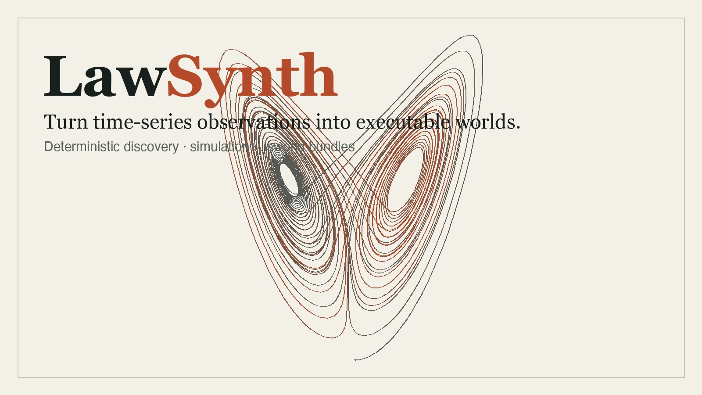
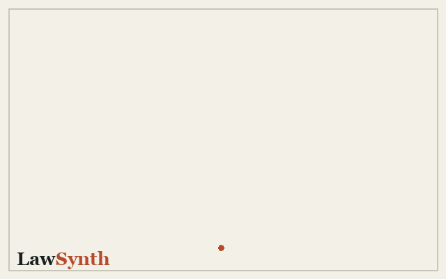
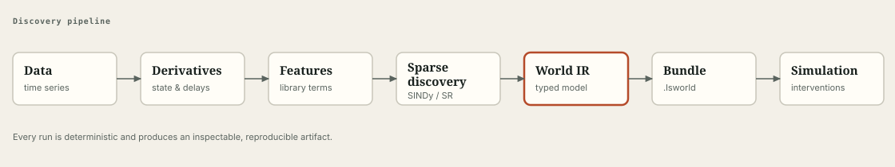

<div align="center">



# LawSynth

**Turn time-series observations into executable mathematical worlds — interpretable law systems you can read, simulate, stress-test, and share.**

Local-first · deterministic · offline. Same inputs → same world, every time.

</div>

---

## What is this? (30 seconds)

You have measurements. LawSynth **discovers the equations behind them** — a sparse
system of state laws (`dx/dt = …`) recovered directly from a CSV — and hands you a
portable `.lsworld` bundle you can understand, run forward, intervene on, compare,
and share as a single self-contained HTML report.

It is a *mechanistic* model, not a black box: every result is a set of equations you
can read. Discovery is **deterministic** (identical inputs and options reproduce the
same world) and **offline** (no data leaves your machine).

<div align="center">

</div>

The whole product is one loop:

```
observe (CSV) → discover (laws) → understand (explain) → use (simulate / forecast /
intervene) → compare → share (report / .lsworld bundle) → organize (library)
```

---

## Install

LawSynth is a Rust workspace with a Python SDK. The core CLI builds from source:

```sh
# Build and install the `lawsynth` binary
cargo install --path crates/lawsynth-cli

# ...or run it in place during development
cargo run -p lawsynth-cli -- --help
```

> Cargo is configured offline by default for reproducible local builds. On a fresh
> machine, run `cargo fetch` once with registry access, then build normally.
> See [docs/getting-started/installation.md](docs/getting-started/installation.md).

Python SDK (builds the native extension with [maturin](https://www.maturin.rs/)):

```sh
cd python/lawsynth
python -m pip install maturin
maturin develop
```

---

## Quickstart — the core loop end to end

Start with a numeric CSV: a header, a strictly increasing finite `time` column, and
one or more finite state columns (here `x,y`).

### CLI

```sh
# 1. Discover the law system and write a portable .lsworld bundle
lawsynth discover observations.csv --time time --state x,y --output world.lsworld

# 2. Understand what it found (readable laws, dependencies, assumptions)
lawsynth explain world.lsworld

# 3. Use it: forecast beyond the observed window, with an optional what-if
lawsynth forecast world.lsworld --horizon 20 --step 0.05 --output forecast.csv

# 4. Share it: a single self-contained HTML report, no server, no external assets
lawsynth report world.lsworld --output report.html
```

### Python (`Study` — the same loop, fluently)

```python
import lawsynth

study = lawsynth.Study.from_csv("observations.csv", time="time", state=["x", "y"])
result = study.discover()          # discover the executable world

print(result.explain())            # readable laws, fit quality, dependencies, assumptions
study.forecast({"x": 1.5})         # what-if: override an initial condition vs. baseline

study.add_scenario("hot", interventions={"x": 2.0})
study.add_scenario("cold", interventions={"x": 0.5})
study.compare_scenarios()          # overlay scenarios against the baseline

study.report("report.html")        # self-contained HTML report
study.save("world.lsworld")        # portable bundle the CLI/Studio also read
```

Every object (`Study`, `DiscoveryResult`, `Explanation`, `Forecast`,
`ScenarioComparison`, trajectories, and the native `World`) renders richly in a
Jupyter notebook.

---

## Feature matrix (by the product loop)

Every capability below is shipped and works against the same validated World IR and
`.lsworld` bundles.

### Discover
| | |
| --- | --- |
| **CLI** | `lawsynth discover OBS.{csv,tsv,parquet} --time COL --state x,y --output world.lsworld` — polynomial `--degree`, `--threshold`, `--solver stlsq\|sr3`, `--trigonometric`, `--rational`, derivative estimators (`--spline`, `--spectral`, `--savgol-window`, `--tvreg-lambda`), `--smooth-radius`, `--bootstrap`, `--symbolic-depth`, `--regimes`, `--pareto`, `--refine`, `--causal` |
| **SDK** | `Study.from_csv(...).discover()`, `lawsynth.discover(time, columns, state=...)`, `DiscoveryConfig` |
| **Studio** | **Data Lens** (profile the dataset), **Discovery Canvas** (configure a run, inspect candidate laws) |

### Understand
| | |
| --- | --- |
| **CLI** | `lawsynth explain world.lsworld`, `lawsynth inspect world.lsworld` |
| **SDK** | `study.explain()` / `result.explain()` → `Explanation` (readable laws, fit R²/RMSE, dependency graph, assumptions) |
| **Studio** | **Equation Explorer**, **Structure Map** (variable coupling), **Regime Timeline**, **Uncertainty Lens** |

### Use
| | |
| --- | --- |
| **CLI** | `lawsynth simulate` / `lawsynth simulate-discrete` (RK4 + discrete stepping, scheduled `--parameter-at TIME:NAME=VALUE` / `--input-at` interventions), `lawsynth forecast --horizon T --intervene NAME=VALUE@TIME` |
| **SDK** | `study.simulate(...)`, `study.forecast({state: value}, horizon=..., step=...)` → `Forecast` (baseline vs. counterfactual + divergence) |
| **Studio** | **World Lab** (simulate, forecast, intervene) |

### Compare
| | |
| --- | --- |
| **CLI** | `lawsynth compare A.lsworld B.lsworld [--json] [--html FILE]`, `lawsynth scenarios world.lsworld --scenario NAME[:k=v@t,...] [--html FILE]` |
| **SDK** | `study.add_scenario(label, interventions=...)`, `study.compare_scenarios()` → `ScenarioComparison` |
| **Studio** | **Scenario Board** (overlay what-ifs against a baseline) |

### Share
| | |
| --- | --- |
| **CLI** | `lawsynth report world.lsworld --output report.html`, `lawsynth export world.lsworld --format python\|latex\|json` |
| **SDK** | `study.report("report.html")`, `study.save("world.lsworld")`, notebook `StudyDashboard` |
| **Studio** | **Export** (equations, LaTeX, Python, raw World IR) |

### Organize
| | |
| --- | --- |
| **CLI** | `lawsynth library <add\|list\|show\|remove> [--dir DIR]` — tag, describe, and search a local world library (index defaults to `~/.lawsynth/library.tsv`) |
| **SDK** | `Study.save(...)` / `Study.load(...)` for `.lsworld` round-trips |

### Explore & scaffold
| | |
| --- | --- |
| **CLI** | `lawsynth templates`, `lawsynth new TEMPLATE [--output world.lsworld] [--data obs.csv] [--samples N]` (built-in worlds: `lorenz`, `lotka-volterra`, `pendulum`, `van-der-pol`, `sir`), `lawsynth validate world.lsworld --data obs.csv [--holdout FRACTION]`, `lawsynth pipeline PIPELINE.toml \| lawsynth pipeline --example`, `lawsynth doctor` |
| **SDK** | `Study.from_source(kind, resource, ...)` / `lawsynth.load_source(...)` — import from `filesystem`, `http`, `s3`, `postgres`, `sqlite` connectors |
| **Studio** | 9 navigable screens driven by shared TypeScript packages |

---

## Surfaces

| Surface | For | Entry point |
| --- | --- | --- |
| **CLI** | power users, automation, CI | `lawsynth <command>` (`crates/lawsynth-cli`) |
| **Python SDK** | notebooks, pipelines | `import lawsynth` → `Study` (`python/lawsynth`) |
| **Studio** | interactive exploration | 9 screens (`apps/studio`) |
| **Services** | teams, self-hosting | `/v1` HTTP API (`services/api`) |

All four operate on the **same validated World IR and `.lsworld` bundles**. A
discovery made in the CLI opens in the SDK, renders in Studio, and serves from the API.

### HTTP product endpoints

The API mirrors the product loop over its stored worlds, backed by the same native
engine as the CLI/SDK:

| Method | Path | Action |
| --- | --- | --- |
| `GET` | `/v1/worlds/{id}/explain` | structured explanation (laws, dependencies, complexity, assumptions) |
| `POST` | `/v1/worlds/{id}/forecast` | simulate-backed forecast honouring scheduled interventions |
| `GET` | `/v1/worlds/{id}/report` | self-contained HTML report |
| `POST` | `/v1/worlds/compare` | structured diff of two worlds |
| `POST` | `/v1/worlds/{id}/simulate` | RK4 simulation |

`explain` / `report` / `compare` read declarative structure and work offline;
`forecast` / `simulate` require the compiled native engine (and return a clear
`503 native_unavailable` otherwise). See [services/api/docs/api.md](services/api/docs/api.md).

---

## How it works

<div align="center">

</div>

Multivariate observations flow through **derivative reconstruction** (finite
differences, Savitzky–Golay, natural cubic spline, spectral, or total-variation
regularization), a **feature library** (polynomial, optional trigonometric and
bounded rational terms), and **sparse regression** (STLSQ or SR3) into a validated
**World IR**. That IR compiles to a portable `.lsworld` bundle and to a deterministic
simulation. Optional stages add a Pareto complexity/accuracy frontier, regime
segmentation, parameter refinement, bootstrap uncertainty, and causal hypotheses.

---

## Principles

- **Interpretable first.** If you can't read and reason about the result, it isn't a
  LawSynth result.
- **Local-first & reproducible.** Same inputs → same world, offline, forever.
- **Honest about uncertainty.** Fit quality, assumptions, and the fact that
  extrapolation beyond the observed window is *not* validated are surfaced, never hidden.
  Discovery finds a sparse fit — it is not proof that a relation is causal.
- **Composable.** CLI, SDK, Studio, and services share one World IR and bundle format.

---

## Documentation

- **[Getting started](docs/getting-started/README.md)** — [installation](docs/getting-started/installation.md) · [quickstart](docs/getting-started/quickstart.md) · [your first world](docs/getting-started/first-world.md) · [CLI](docs/getting-started/cli.md) · [Python](docs/getting-started/python.md) · [Studio](docs/getting-started/studio.md)
- **[Product overview](PRODUCT.md)** — what a user actually does with LawSynth
- **[Reference](docs/reference/README.md)** — CLI, Python, and Rust API references
- **[Methods](docs/methods/differentiation/README.md)** — differentiation, simulation, and causal method notes
- **[Self-hosting](docs/self-hosting/README.md)** — running the services surface
- **[Architecture](ARCHITECTURE.md)** · **[Contributing](CONTRIBUTING.md)** · **[Changelog](CHANGELOG.md)**

---

## License

Licensed under [Apache-2.0](LICENSE). Third-party notices, when required, are recorded
in [NOTICE](NOTICE).
